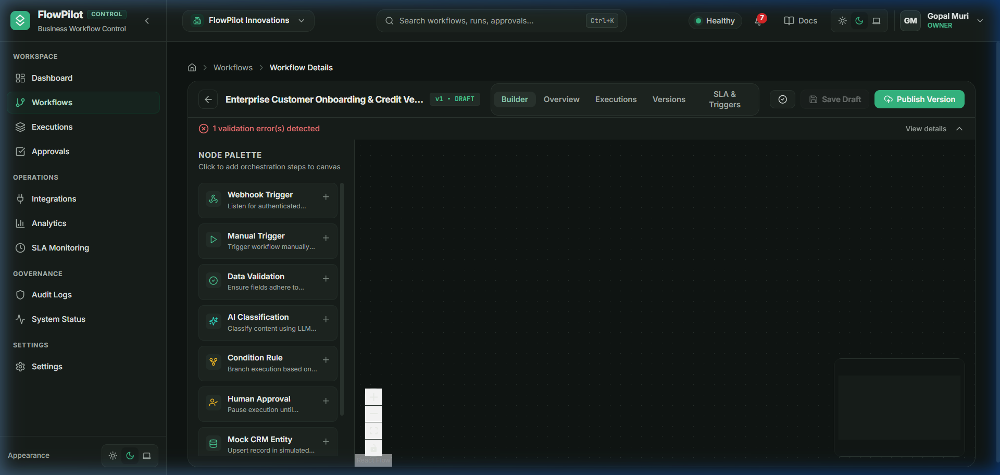
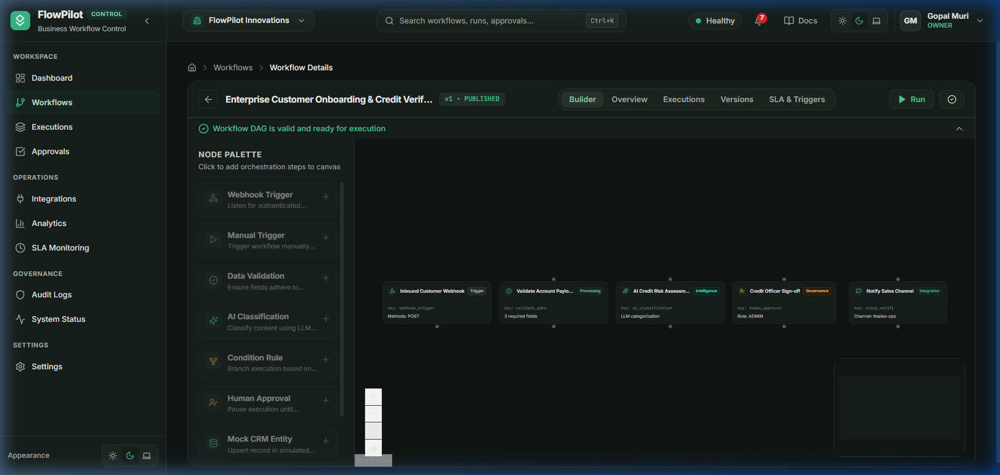
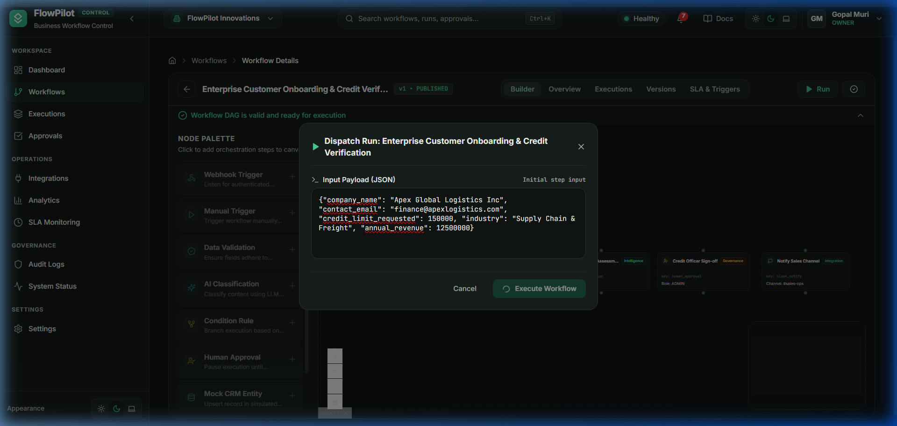
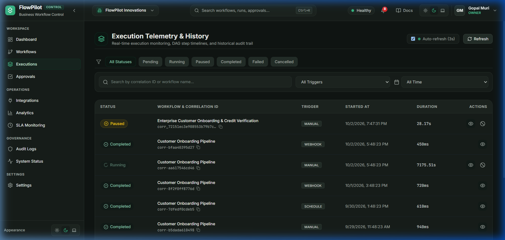
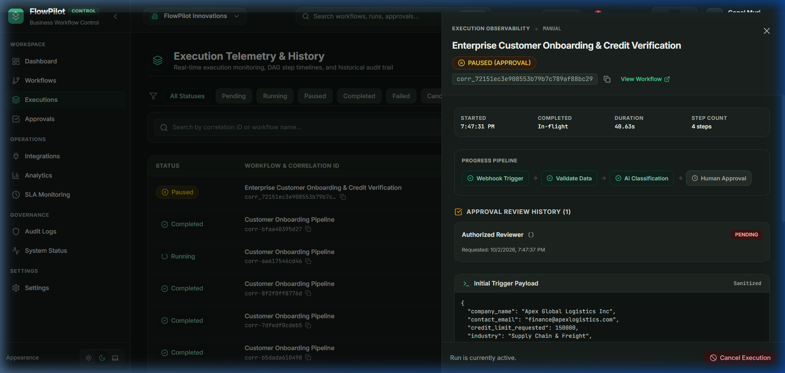
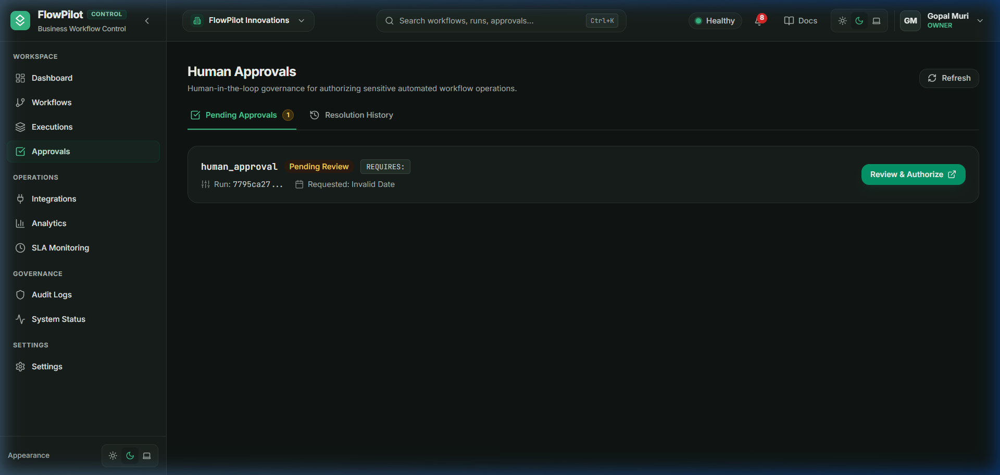
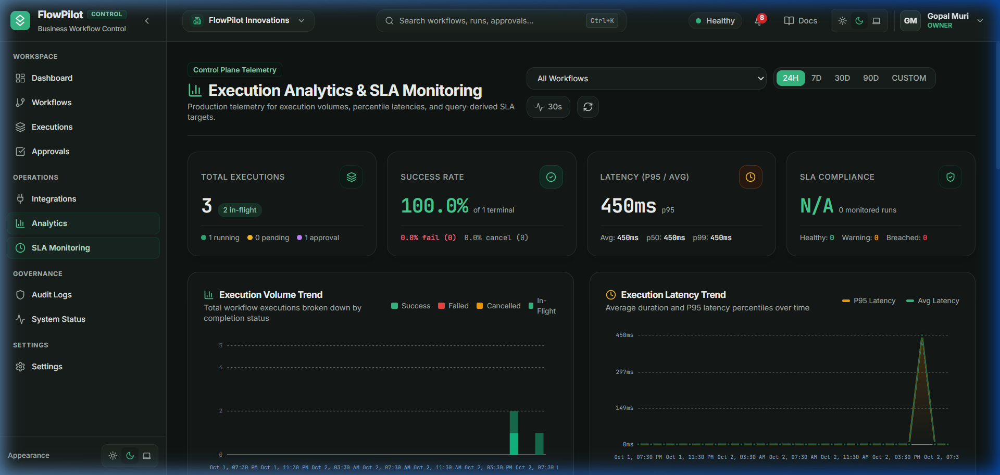
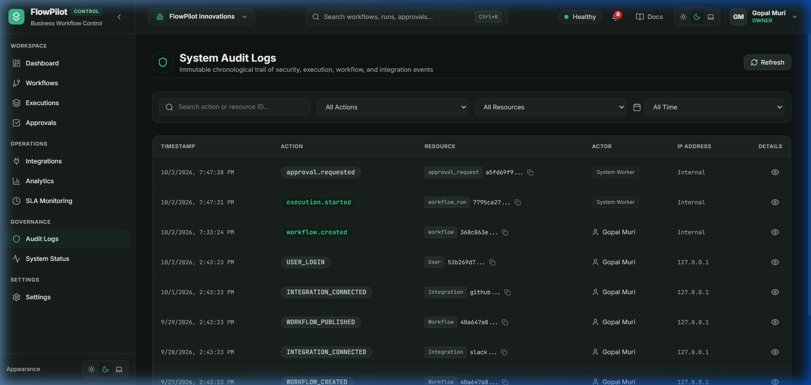

# FlowPilot — Hands-on UI Operator & Control Plane Guide

> **Target Audience:** Operators, Product Managers, Workflow Engineers, and Business Analysts.  
> **System Scope:** 100% UI-driven operations through the FlowPilot Web Application.  
> **Core Scenario:** *Enterprise Customer Onboarding & Credit Verification Pipeline*.

---

## 1. Operational Overview & Pipeline Scenario

Throughout this guide, we execute the standard B2B automation scenario built into FlowPilot:

```
[Inbound Webhook] 
       │
       ▼
[Validate Account Payload]
       │
       ▼
[AI Credit Risk Assessment]
       │
       ▼
[Credit Officer Sign-off (Human Approval)]
       │
       ▼
[Notify Sales Channel (Slack)]
```

---

## Stage 1: Authentication & Organization Selection

### Step 1.1: Sign In to FlowPilot Control Plane

- **ACTION:** Open `http://localhost:5173/login`. Enter email `gopalmuri1919@gmail.com` and password `Password123!`. Click **"Sign In"**.
- **WHY:** FlowPilot enforces multi-tenant organization boundaries. Authentication verifies your credentials and loads your active organization context (`FlowPilot Innovations`).
- **WHAT HAPPENS:** The backend issues a signed JWT access token and secure HttpOnly refresh cookie, redirecting you to `/dashboard`.
- **WHAT TO OBSERVE:** The top-left header displays `FlowPilot Innovations • Control Plane`, and the metric cards display live counts.
- **NEXT:** Move to the Workflows registry.

---

## Stage 2: Creating a New Workflow Definition

### Step 2.1: Open the Workflow Registry

- **ACTION:** In the left sidebar under **WORKSPACE**, click **"Workflows"**.
- **WHY:** To access the organization's automation graph catalog.
- **WHAT HAPPENS:** FlowPilot navigates to `/workflows`.
- **WHAT TO OBSERVE:** The list of existing workflows and the **"+ Create Workflow"** button in the top right.

### Step 2.2: Enter Workflow Metadata

- **ACTION:** Click **"+ Create Workflow"** and enter:
  - **Workflow Name (Required):** `Enterprise Customer Onboarding & Credit Verification`
  - **Description (Optional):** `Processes newly signed enterprise accounts: assesses credit risk via AI, gates high-limit accounts for human approval, and notifies ops on Slack.`
  - Click **"Create & Open Editor"**.
- **WHY:** To initialize the workflow record and version 1 (`v1` in `DRAFT` status).
- **WHAT HAPPENS:** FlowPilot creates the database record and opens the visual drag-and-drop editor (`/workflows/<id>`).
- **WHAT TO OBSERVE:**



---

## Stage 3: Visual Canvas & Step Orchestration

### Step 3.1: Assemble the Pipeline Nodes

- **ACTION:** From the left-hand **Node Palette**, add the following 5 nodes to the canvas:
  1. `Webhook Trigger` (Category: *Triggers*)
  2. `Data Validation` (Category: *Processing*)
  3. `AI Classification` (Category: *Intelligence*)
  4. `Human Approval` (Category: *Governance*)
  5. `Slack Notification` (Category: *Integrations*)
- **WHY:** Each node represents a distinct micro-task executed by the Celery worker engine.
- **WHAT HAPPENS:** Each step appears as a card on the interactive canvas with input (left) and output (right) handles.

### Step 3.2: Configure Node Properties & Connect Handles

- **ACTION:** Connect the output handle of each step to the input handle of the next:
  - `Inbound Webhook` $\rightarrow$ `Validate Payload`
  - `Validate Payload` $\rightarrow$ `AI Risk Assessment`
  - `AI Risk Assessment` $\rightarrow$ `Human Approval`
  - `Human Approval` $\rightarrow$ `Slack Notification`
- **WHY:** FlowPilot executes workflows as a Directed Acyclic Graph (DAG). Edges define sequential dependency.

---

## Stage 4: Version Validation & Publishing

### Step 4.1: Validate DAG Graph

- **ACTION:** Click the **"Validate"** button in the top toolbar.
- **WHY:** The client and server perform topological graph analysis to verify that there are no cycles, no isolated orphan nodes, and that all node configs satisfy schema requirements.
- **WHAT TO OBSERVE:** The bottom validation bar turns green: *"Workflow DAG is valid and ready for execution"*.

### Step 4.2: Publish Version

- **ACTION:** Click **"Publish Version"** and confirm.
- **WHY:** In FlowPilot, draft versions cannot be executed in production. Publishing freezes `v1` as immutable and activates the workflow (`ACTIVE`).
- **WHAT TO OBSERVE:**



Notice the badge changes to **`v1 • PUBLISHED`** and the **"Run"** button becomes active.

---

## Stage 5: Providing Business Input & Triggering Execution

### Step 5.1: Open Execution Dispatch Dialog

- **ACTION:** Click the **"Run"** button (play icon) in the top toolbar.
- **WHY:** To test the live pipeline with actual customer onboarding data.
- **WHAT HAPPENS:** A modal opens titled **"Execute Workflow Version"**.

### Step 5.2: Enter Business Payload

- **ACTION:** Paste the following JSON payload into the text area:

```json
{
  "company_name": "Apex Global Logistics Inc",
  "contact_email": "finance@apexlogistics.com",
  "credit_limit_requested": 150000,
  "industry": "Supply Chain & Freight",
  "annual_revenue": 12500000
}
```

- **Data Breakdown:**
  - `company_name`: Target commercial entity.
  - `credit_limit_requested`: High limit ($150,000) that will trigger human sign-off.
  - `annual_revenue`: Financial metric for AI credit evaluation.
- **ACTION:** Click **"Execute Workflow"**.
- **WHAT TO OBSERVE:**



A confirmation toast appears: *"Execution triggered successfully! Run ID: <uuid>"*.

---

## Stage 6: Real-time Execution Monitoring

### Step 6.1: Navigate to Executions Registry

- **ACTION:** In the sidebar under **WORKSPACE**, click **"Executions"**.
- **WHY:** To monitor live executions, run statuses, execution durations, and trigger types.
- **WHAT TO OBSERVE:**



The top row shows our newly triggered run with:
- **Workflow:** `Enterprise Customer Onboarding & Credit Verification`
- **Trigger:** `MANUAL`
- **Status:** **`PAUSED`** (or `RUNNING`), indicating it has reached the human approval checkpoint.

---

## Stage 7: Execution Timeline Inspection

### Step 7.1: Open the Timeline Drawer

- **ACTION:** Click on the execution row or click the **"View"** icon on the right side.
- **WHY:** To inspect step-by-step telemetry, intermediate outputs, and AI classification results.
- **WHAT TO OBSERVE:**



- The **Timeline Drawer** slides in from the right.
- You can inspect:
  1. **Correlation ID:** Unique trace ID for system-wide auditing.
  2. **Trigger Payload:** The exact JSON input provided at runtime.
  3. **Step 1 (Inbound Customer Webhook):** `COMPLETED`
  4. **Step 2 (Validate Account Payload):** `COMPLETED` (Verified required fields present).
  5. **Step 3 (AI Credit Risk Assessment):** `COMPLETED` (AI evaluated revenue vs limit).
  6. **Step 4 (Credit Officer Sign-off):** `PAUSED (WAITING_APPROVAL)`.

---

## Stage 8: Human Approval Governance

### Step 8.1: Inspect Pending Approvals

- **ACTION:** In the left sidebar under **WORKSPACE**, click **"Approvals"**.
- **WHY:** Human-in-the-loop governance halts autonomous execution when high-risk operations (such as a $150,000 credit limit) are requested.
- **WHAT TO OBSERVE:**



- A pending approval card titled **"Credit Officer Sign-off"**.
- **Payload Snapshot:** Summarizes customer details (`Apex Global Logistics Inc`, `$150,000`).
- **Actions:** **"Approve"** (green) or **"Reject"** (red).

### Step 8.2: Authorize Request

- **ACTION:** Click **"Approve"**, enter an optional comment (*"Financial statements verified, approved for onboarding"*), and confirm.
- **WHAT HAPPENS:** FlowPilot records the reviewer ID, unblocks the execution queue, resumes the Celery worker, executes Step 5 (`Notify Sales Channel`), and marks the run as `COMPLETED`.

---

## Stage 9: Operational Analytics & SLA Tracking

### Step 9.1: Inspect Analytics Dashboard

- **ACTION:** In the left sidebar under **OPERATIONS**, click **"Analytics"**.
- **WHY:** To analyze system throughput, failure rates, step latencies, and SLA compliance.
- **WHAT TO OBSERVE:**



- **Total Executions & Success Rate:** Aggregate telemetry across all runs.
- **Execution Volume Chart:** Hourly/daily distribution of workflow runs.
- **Duration Trends:** P50, P95, and P99 latency percentiles.
- **SLA Monitoring:** Tracks whether executions completed within target thresholds.

---

## Stage 10: Security & Audit Trail Governance

### Step 10.1: Review Immutable Audit Logs

- **ACTION:** In the left sidebar under **GOVERNANCE**, click **"Audit Logs"**.
- **WHY:** Enterprise compliance requires an append-only log of every user login, workflow creation, execution trigger, and approval decision.
- **WHAT TO OBSERVE:**



- Events logged with ISO timestamp:
  - `execution.started`: Triggered by user `gopalmuri1919@gmail.com`.
  - `approval.requested`: Step `Credit Officer Sign-off` paused execution.
  - `workflow.published`: Version 1 published to active state.
- Clicking any audit log row displays the IP address and event payload details.

---

## Stage 11: Failure Investigation & Debugging (UI Guide)

When a workflow run shows **`FAILED`** in red:

1. **Locate the Failure:**
   - Go to **Executions** (`/executions`).
   - Use the **Status Filter** dropdown $\rightarrow$ Select **"Failed"**.
2. **Open the Timeline:**
   - Click on the failed execution row to open the **Timeline Drawer**.
3. **Identify the Failed Step:**
   - Look for the step highlighted in red with a warning icon ($\times$).
   - Completed steps show green checkmarks; unreached steps show as grey.
4. **Inspect the Error Message:**
   - Click on the failed step card.
   - Read the **Error Message** and **Exception Traceback** (e.g. `Validation failed: missing contact_email` or `External API 504 Gateway Timeout`).
5. **Retry the Execution:**
   - Click the **"Retry Run"** button in the drawer header.
   - FlowPilot re-queues the execution from the failed step without losing previous step state.

---

## Summary Checklist for Operators

| Action | UI Location | Key Check Before Proceeding |
| :--- | :--- | :--- |
| **Create Workflow** | `/workflows` $\rightarrow$ `+ Create Workflow` | Name is unique and descriptive |
| **Design DAG** | `/workflows/:id` (Builder tab) | Exactly 1 trigger; all steps connected |
| **Validate** | Top toolbar $\rightarrow$ `Validate` | Green banner: "Workflow DAG is valid" |
| **Publish** | Top toolbar $\rightarrow$ `Publish Version` | Badge changes to `v1 • PUBLISHED` |
| **Run / Test** | Top toolbar $\rightarrow$ `Run` | JSON payload matches required input keys |
| **Inspect Run** | `/executions` $\rightarrow$ Click row | Timeline shows green steps and intermediate outputs |
| **Handle Approvals** | `/approvals` | Verify payload snapshot before approving |
| **Verify Audit** | `/audit` | Ensure `execution.started` and approval events are recorded |
| **Review Metrics** | `/analytics` | Check success rate and SLA compliance |
