# FlowPilot — Phase 16 Implementation Plan
## Automated Testing, Security Hardening & Production CI/CD

> **Document Version:** 1.0.0  
> **Status:** COMPLETED  
> **Target Phase:** Phase 16 (Final Roadmap Milestone)  
> **Database Migrations:** ZERO (0)  

---

## 1. Executive Summary

FlowPilot Phases 1–15 established a multi-tenant, event-driven workflow automation platform with a visual builder (@xyflow/react), asynchronous task processing (Celery + Redis), AI lead classification, human approvals, deterministic execution, and version-scoped SLA execution analytics. 

**Phase 16** is the final hardening milestone. It does not introduce new business features, workflow executors, or AI providers. Instead, it transitions FlowPilot from feature-complete development to enterprise production readiness across four pillars:
1. **Security Hardening**: Implementation of strict HTTP security headers (HSTS, CSP, X-Content-Type-Options, X-Frame-Options, Referrer-Policy), production CORS validation, cookie-hardening & CSRF defense, and distributed Redis token-bucket rate limiting on authentication, public webhooks, and analytical endpoints.
2. **Automated Testing & End-to-End Simulation**: Comprehensive E2E lead automation pipeline test traversing `Webhook Ingestion -> AI Classification -> Condition Evaluation -> Human Approval -> Mock CRM/Slack -> Audit Logging -> Analytics Aggregation`, accompanied by 16 negative failure-path scenarios.
3. **Coverage & CI/CD Pipeline Hardening**: Elevating backend test coverage from 75% to $\ge 80\%$ overall and from 82.7% to $\ge 85\%$ across the core workflow engine. Establishing a unified GitHub Actions workflow with PostgreSQL and Redis service containers, Ruff linting, Mypy static typing, frontend ESLint + Vitest runs, and production Vite bundle verification.
4. **Production Readiness & Operations**: Production multi-stage Docker configurations, Nginx reverse-proxy & TLS termination specifications, startup environment validation rejecting unsafe dev keys, health/readiness probes (`/health/live`, `/health/ready`), and operational runbooks for secret rotation and disaster recovery.

---

## 2. Repository Inspection Findings

An empirical audit of the repository (`E:\flowpilot`) revealed the following concrete architectural baseline:

| Subsystem | Existing Implementation / File Reference | Findings & Phase 16 Requirements |
|---|---|---|
| **FastAPI Core** | [`backend/app/main.py`](file:///E:/flowpilot/backend/app/main.py) | Includes CORS middleware and 11 routers. **Lacks** HTTP security headers middleware (HSTS, CSP, X-Frame-Options) and production-enforced CORS origin validation. |
| **Settings & Config** | [`backend/app/core/config.py`](file:///E:/flowpilot/backend/app/core/config.py) | Pydantic `BaseSettings`. Dev defaults for `SECRET_KEY`, `JWT_SECRET`, `ENCRYPTION_KEY`. `validate_production_key()` exists in `encryption.py` but startup does not validate `SECRET_KEY` or `JWT_SECRET` against dev defaults in production. |
| **Authentication & Cookies** | [`backend/app/routers/auth.py`](file:///E:/flowpilot/backend/app/routers/auth.py) | Dual-token model: 30m Access JWT, 7d Refresh JWT. Refresh token stored in Redis and issued as HttpOnly cookie (`path="/api/v1/auth"`, `samesite="lax"`, `secure=env=="production"`). **Lacks** rate limiting on `/login` and `/refresh`. |
| **Webhooks** | [`backend/app/routers/webhooks.py`](file:///E:/flowpilot/backend/app/routers/webhooks.py) | Public `/api/v1/webhooks/{key}` and tenant-scoped `/webhooks`. Payload capped at 1MB (`validate_payload_size`). HMAC signature and Redis idempotency verified. **Lacks** IP/key-based rate limiting. |
| **Health Checks** | [`backend/app/routers/health.py`](file:///E:/flowpilot/backend/app/routers/health.py) | Checks PostgreSQL `SELECT 1`, Redis `ping()`, and Celery broker `ping()`. Returns `200` with `"status": "healthy" \| "degraded"`. Needs distinct Kubernetes-style `/health/live` and `/health/ready` probes. |
| **Backend Tests** | `backend/tests/` (239 tests) | 239 passed in 327s. Empirical coverage: **75% overall** (4,686 stmts, 1,183 missed); **82.7% core engine** (`app/engine/`). Gap to reach $\ge 80\%$ overall and $\ge 85\%$ core engine. |
| **Frontend Tests** | `frontend/src/tests/` (59 tests) | 59 passed across 12 suites in 21s. Production build (`tsc -b && vite build`) passes in 8.7s. |
| **Frontend Tooling** | [`frontend/package.json`](file:///E:/flowpilot/frontend/package.json) | Script `"lint": "eslint ."` fails because `eslint` and plugins are not listed in `devDependencies`. |
| **Docker & Compose** | [`docker-compose.yml`](file:///E:/flowpilot/docker-compose.yml), `backend/Dockerfile`, `frontend/Dockerfile` | Backend Dockerfile runs root user in development mode with `--reload`. Frontend Dockerfile runs `npm run dev`. No production multi-stage build or Nginx reverse proxy. |
| **CI Workflow** | [`.github/workflows/ci.yml`](file:///E:/flowpilot/backend/../.github/workflows/ci.yml) | Outdated CI script: references `test_auth_api.py` (actual path is `test_auth.py`), lacks Vitest step in frontend job, missing rate limit & security test execution. |

---

## 3. Current Security Posture

### Strengths
- **Cryptographic Storage**: AES-256-GCM authenticated encryption (`app/core/encryption.py`) with 12-byte random nonces and AEAD verification for third-party integration credentials.
- **Password Security**: Argon2id hashing with memory-hard parameters (`time_cost=3`, `memory_cost=65536`, `parallelism=4`).
- **Secret Redaction**: `app/engine/sanitizer.py` recursively scrubs authorization tokens, credentials, API keys, and passwords from logs, audit trails, and execution context.
- **SSRF Protection**: `app/core/ssrf.py` blocks loopback, private RFC-1918, link-local, cloud metadata IP ranges, and enforces DNS resolution timeout limits.
- **Tenant Isolation**: Mandatory `get_org_context` dependency enforcing active membership; cross-tenant accesses return uniform `404 Not Found`.

### Vulnerability & Hardening Gaps
1. **Missing Security Response Headers**: Browser clients do not receive HSTS, CSP, `X-Content-Type-Options: nosniff`, or `X-Frame-Options: DENY`.
2. **Missing Rate Limiting**: Brute-force attacks against `/api/v1/auth/login` or denial-of-service volumetric floods against `/api/v1/webhooks/{key}` are not bounded by token-bucket algorithms.
3. **CORS Development Permissiveness**: If deployed with default settings, wildcard/localhost origins remain active.
4. **Secret Configuration Leak Potential**: If `ENVIRONMENT=production`, the server boots even if `SECRET_KEY` or `JWT_SECRET` are left as development defaults.
5. **Missing Multi-Stage Minimal Containers**: Containers run development runtimes as root.

---

## 4. Security Hardening Plan

### 4.1 Security Headers Middleware
Implement production-grade ASGI middleware in `backend/app/core/middleware.py`:
- `Strict-Transport-Security`: `max-age=63072000; includeSubDomains; preload` (enforced when `ENVIRONMENT == "production"` or `FORCE_HTTPS == True`).
- `X-Content-Type-Options`: `nosniff` (prevents MIME-type sniffing).
- `X-Frame-Options`: `DENY` (prevents clickjacking).
- `Referrer-Policy`: `strict-origin-when-cross-origin`.
- `Permissions-Policy`: `camera=(), microphone=(), geolocation=(), payment=()`.
- `X-XSS-Protection`: `0` (disabled in modern browsers in favor of CSP).

### 4.2 Content Security Policy (CSP) Design
The CSP must not break React 18, Vite production hashed assets, inline styles generated by `@xyflow/react`, or Google Fonts.
- **Production CSP**:
  ```http
  Content-Security-Policy: default-src 'self'; script-src 'self'; style-src 'self' 'unsafe-inline' https://fonts.googleapis.com; font-src 'self' https://fonts.gstatic.com data:; img-src 'self' data: https:; connect-src 'self' http://localhost:8000 https:; frame-ancestors 'none'; object-src 'none'; base-uri 'self'; form-action 'self';
  ```
- **Development CSP**:
  Permits `'unsafe-eval'` for Vite HMR (Hot Module Replacement) and WebSocket connections to `ws://localhost:5173`.

---

## 5. Redis Rate Limiting Plan

### 5.1 Architecture & Algorithm
- **Algorithm**: Redis Lua-based **Sliding Window Counter** or atomic token bucket ensuring precision across concurrent worker instances without race conditions.
- **Fail-Open Strategy**: If Redis is temporarily unreachable, rate limiting logs a critical warning and fails open (`allowed=True`) to prevent cascading downtime of legitimate user traffic.
- **Response Headers**:
  - `X-RateLimit-Limit`: Maximum requests permitted in window.
  - `X-RateLimit-Remaining`: Requests remaining in current window.
  - `X-RateLimit-Reset`: Unix timestamp when quota refreshes.
  - `Retry-After`: Seconds to wait when returning HTTP `429 Too Many Requests`.

### 5.2 Rate Limit Tiers & Thresholds

| Endpoint Scope | Identity Dimension | Limit / Window | Rationale & Protection |
|---|---|---|---|
| **Authentication: Login** | `ip + email` | 5 req / 1 min | Mitigates credential stuffing while allowing legitimate retries. |
| **Authentication: Refresh** | `ip + user_id` | 30 req / 1 min | Supports legitimate token rotation across multi-tab sessions. |
| **Authentication: Register** | `ip` | 3 req / 1 hour | Prevents bot account generation. |
| **Public Webhooks** | `webhook_key` + `ip` | 100 req / 1 min | Protects database and Redis queue from volumetric denial-of-service. |
| **Tenant Webhooks** | `org_id` + `workflow_id` | 300 req / 1 min | Allows high-throughput production event ingestion. |
| **Analytics Overview / SLA** | `org_id` + `user_id` | 60 req / 1 min | Protects analytical PostgreSQL percentile calculations from exhaustion. |
| **Internal Celery Tasks** | *Exempt* | Unlimited | Distributed background tasks must not be throttled via HTTP rate limiters. |

---

## 6. CSRF, CORS & Cookie Security Plan

### 6.1 Cookie Security Matrix
- **`refresh_token` Cookie**:
  - `HttpOnly`: `True` (strictly inaccessible to JavaScript; immune to XSS theft).
  - `Secure`: `True` in production (transmitted only over TLS 1.3).
  - `SameSite`: `"Lax"` (provides CSRF defense against third-party cross-site POSTs while allowing top-level navigation).
  - `Path`: `"/api/v1/auth"` (cookie is never sent to webhook, workflow, or analytics endpoints).

### 6.2 CSRF Threat Model & Defense
- **API Architecture Analysis**: FlowPilot’s operational endpoints (`/workflows`, `/webhooks`, `/approvals`, `/analytics`) authenticate via the `Authorization: Bearer <access_token>` header. Bearer tokens stored in frontend application memory are immune to standard browser ambient-credential CSRF attacks.
- **Refresh Endpoint Defense**: For `/api/v1/auth/refresh`, which reads the HttpOnly cookie:
  1. Header Verification: Enforce `Sec-Fetch-Site` header checks (`same-origin` or `same-site`).
  2. Origin/Referer Validation: Reject requests where the `Origin` or `Referer` does not strictly match `ALLOWED_CORS_ORIGINS`.

### 6.3 CORS Production Hardening
- Reject wildcard `["*"]` when `allow_credentials=True`.
- On application startup, validate that `ALLOWED_CORS_ORIGINS` contains explicit HTTPS origins in production.
- If `ENVIRONMENT == "production"` and any origin contains `localhost` or `127.0.0.1`, raise a `RuntimeError` preventing unsafe startup.

---

## 7. Security Testing Plan

Create dedicated test suite `backend/tests/security/test_security_hardening.py` covering:
1. **Security Headers Verification**: Validate all 6 HTTP headers on all API responses (`/`, `/api/v1/health`, `/api/v1/auth/login`).
2. **CSP Validation**: Confirm script-src, frame-ancestors, and style-src constraints.
3. **CORS Boundary Testing**:
   - Authorized origin receives `Access-Control-Allow-Origin: https://app.flowpilot.com`.
   - Unauthorized origin receives no CORS headers.
   - Wildcard with credentials rejected on startup.
4. **Cookie Flags Assertion**: Validate `HttpOnly`, `Secure`, `SameSite=Lax`, and `Path=/api/v1/auth` attributes on login/refresh responses.
5. **CSRF Origin Mismatch Rejection**: Sending refresh requests with `Origin: https://attacker.com` returns HTTP 403 Forbidden.
6. **Rate Limiting Enforcement**:
   - Exceeding 5 login attempts triggers HTTP 429 with `Retry-After` header.
   - Rate limit reset window expiry clears block.
   - Redis fail-open resilience when cache connection times out.
7. **Secret Sanitization Audit**:
   - Ensure logs and exception outputs redact passwords, tokens, API keys, and HMAC secrets.

---

## 8. Full E2E Test Scenario (Lead Automation Flow)

Design `backend/tests/e2e/test_lead_automation_e2e.py` utilizing actual Phase 9–15 components:

```
[Inbound Webhook HTTP POST] 
       │ (Payload: Enterprise lead with 250 employees)
       ▼
[Webhook Ingestion & Fast ACK] 
       │ (Generates idempotent WorkflowRun in PENDING state < 100ms)
       ▼
[Celery Background Task Execution]
       │
       ▼
[Node 1: AI Lead Classifier]
       │ (MockAIProvider: "enterprise", priority "high", confidence 0.95)
       ▼
[Node 2: Condition Evaluator]
       │ (AST Evaluator: lead_category == 'enterprise' -> True)
       ▼
[Node 3: Human Approval Request]
       │ (Execution paused -> Status: WAITING_APPROVAL)
       ▼
[Manager Approval Action]
       │ (POST /api/v1/approvals/{id}/approve -> Status resumes to RUNNING)
       ▼
[Node 4: Mock CRM Integration]
       │ (Creates enterprise CRM lead with assigned deal size)
       ▼
[Node 5: Slack Notifier Integration]
       │ (Posts notification block payload to target channel)
       ▼
[Execution Completion]
       │ (WorkflowRun -> SUCCESS, completed_at stamped)
       ▼
[Audit Log Verification]
       │ (Atomic audit records: webhook_received, approval_granted, run_completed)
       ▼
[Analytics Query Aggregation]
       │ (GET /analytics/overview reflects incremented volume, 100% success rate, SLA HEALTHY)
```

---

## 9. Negative E2E Failure Scenarios

Implement 16 robust negative integration scenarios in `backend/tests/e2e/test_negative_scenarios_e2e.py`:
1. **Invalid Webhook HMAC Signature**: Mismatched signature returns HTTP 401 Unauthorized.
2. **Expired Webhook Timestamp**: Request timestamp older than 300 seconds rejected.
3. **Duplicate Webhook Idempotency**: Identical `X-Idempotency-Key` within TTL returns cached 202 response without creating duplicate `workflow_runs`.
4. **Oversized Webhook Payload**: Payload $> 1\text{ MB}$ returns HTTP 413 Request Entity Too Large.
5. **Malformed Webhook JSON**: Unparseable body returns HTTP 400 Bad Request.
6. **AI Provider Timeout & Fallback**: Simulating provider latency triggers timeout handler and falls back gracefully.
7. **Condition Evaluation False Branch**: Evaluates condition to `false` and follows correct alternate branch.
8. **Human Approval Rejection**: Rejection stops downstream steps; marks run `FAILED` or `CANCELLED`.
9. **CRM Service Unavailable**: Mock CRM failure triggers defined retry policy and logs sanitized error.
10. **Slack Service Invalid URL**: SSRF validator blocks attempt to notify private/loopback URL.
11. **In-Flight Run Cancellation**: Active run is cancelled via `POST /executions/{id}/cancel` while waiting approval.
12. **Unauthorized Approval Attempt**: `OPERATOR` attempting to approve returns HTTP 403 Forbidden.
13. **Cross-Tenant Run Query**: Tenant B requesting Tenant A's run returns HTTP 404 Not Found.
14. **Draft SLA Update on Published Version**: Attempting `PUT /sla` on published version returns HTTP 400.
15. **Invalid SLA Threshold Configuration**: Setting warning threshold $\ge$ target seconds returns HTTP 422.
16. **Database Disconnection During Run**: Workflow engine captures connection failure, records error state, and rolls back cleanly.

---

## 10. Test Coverage Audit & Elevation Strategy

### Current Empirical Measurement
- **Overall Codebase Coverage:** **75%** (3,503 / 4,686 statements covered; 1,183 missed).
- **Core Engine Coverage (`app/engine/`):** **82.7%** (730 / 883 statements covered; 153 missed).

### Target Benchmarks
- **Core Engine Target:** $\ge \mathbf{85\%}$ (Requires covering $+25$ statements in `condition_evaluator.py` and `workflow_engine.py`).
- **Overall Codebase Target:** $\ge \mathbf{80\%}$ (Requires covering $+240$ statements across low-coverage modules).

### High-ROI Coverage Expansion Targets

| Module Path | Current Coverage | Uncovered Paths / Branches | Targeted Test Additions |
|---|---|---|---|
| `app/engine/condition_evaluator.py` | 73% (67 miss) | Nested OR/AND groups, regex operators, date comparisons | Unit tests for complex logical expression AST branches |
| `app/engine/workflow_engine.py` | 85% (55 miss) | Node cycle boundary recovery, timeout exception handlers | Unit tests for engine graph traversal edge cases |
| `app/routers/workflows.py` | 36% (161 miss) | Workflow duplication, version archiving, step delete | Integration tests for workflow lifecycle endpoints |
| `app/services/analytics_service.py` | 40% (122 miss) | Weekly grouping bucket logic, custom date window edges | Service unit tests for date-trunc edge cases |
| `app/routers/executions.py` | 47% (94 miss) | Execution log retrieval, retry failed step paths | API tests for execution rerun and step log streaming |
| `app/routers/auth.py` | 60% (59 miss) | Password reset stubs, inactive user rejection, token expiry | Security tests for token revocation edge cases |

---

## 11. CI/CD Pipeline Hardening Plan

Update `.github/workflows/ci.yml` with a multi-stage, hermetic pipeline:

```mermaid
graph TD
    A[Git Push / PR] --> B[Job: Backend Lint & Typecheck]
    A --> C[Job: Frontend Lint & Test]
    B --> D[Job: Backend Pytest & Coverage with PG/Redis]
    C --> E[Job: Frontend Production Build]
    D --> F[Job: Production Readiness Gate]
    E --> F
```



### 11.1 Backend CI Pipeline
- **Environment**: Ubuntu Latest, Python 3.12 with pip cache.
- **Service Containers**:
  - PostgreSQL 16 Alpine (Healthcheck: `pg_isready`).
  - Redis 7 Alpine (Healthcheck: `redis-cli ping`).
- **Steps**:
  1. `ruff check backend/app backend/tests`
  2. `mypy backend/app`
  3. `pytest --cov=app --cov-report=xml --cov-fail-under=80 backend/tests`
  4. Upload coverage artifact to GitHub Actions summary.

### 11.2 Frontend CI Pipeline
- **Environment**: Ubuntu Latest, Node.js 20 with npm cache.
- **Steps**:
  1. `npm ci`
  2. Fix missing ESLint setup: add `eslint`, `@typescript-eslint/parser`, `@typescript-eslint/eslint-plugin` to `devDependencies`.
  3. `npm run lint`
  4. `npm test -- --run`
  5. `npm run build` (`tsc -b && vite build`)

---

## 12. PostgreSQL + Redis CI Strategy

1. **No SQLite Substitution**: FlowPilot’s Phase 15 analytics utilize PostgreSQL-specific SQL syntax (`PERCENTILE_CONT`, `date_trunc`, `COUNT(*) FILTER`). CI must run against true PostgreSQL.
2. **Isolated Database Initializer**: Each CI run executes `alembic upgrade head` on the fresh PostgreSQL container before running pytest.
3. **Database Transaction Rollback Fixture**: Pytest fixtures wrap integration tests in an outer transaction rolled back upon test completion to ensure zero inter-test state contamination.
4. **Redis DB Namespacing**: CI sets `REDIS_URL=redis://localhost:6379/0` and flushes test databases between suites using `await redis.flushdb()`.

---

## 13. Environment Configuration & Startup Validation

Enhance `backend/app/core/config.py` with strict production validation:

```python
@model_validator(mode="after")
def validate_production_security(self) -> "Settings":
    if self.ENVIRONMENT.lower() == "production":
        # 1. Reject default dev keys
        if "default" in self.SECRET_KEY.lower() or len(self.SECRET_KEY) < 32:
            raise ValueError("Production SECRET_KEY must be a cryptographically secure string >= 32 characters")
        if "default" in self.JWT_SECRET.lower() or len(self.JWT_SECRET) < 32:
            raise ValueError("Production JWT_SECRET must be a cryptographically secure string >= 32 characters")
        # 2. Reject debug mode
        if self.DEBUG:
            raise ValueError("DEBUG must be False in production")
        # 3. Reject insecure CORS
        for origin in self.ALLOWED_CORS_ORIGINS:
            if "localhost" in origin or "127.0.0.1" in origin or origin == "*":
                raise ValueError(f"Unsafe CORS origin '{origin}' forbidden in production")
    return self
```

---

## 14. Docker Production Hardening

### 14.1 Backend Docker Hardening (`backend/Dockerfile.prod`)
- **Multi-Stage Build**: Builder stage installs gcc, compiles wheels; final stage uses `python:3.12-slim` without compilation tools.
- **Non-Root User**: Create system user `flowpilot` (`uid=10001`); run container under non-root.
- **Minimal Footprint**: Purge apt cache, set `PYTHONDONTWRITEBYTECODE=1`, `PYTHONUNBUFFERED=1`.
- **Healthcheck**: Injected `HEALTHCHECK --interval=15s --timeout=5s --retries=3 CMD curl -f http://localhost:8000/api/v1/health/live || exit 1`.
- **Production Server**: Replace dev `uvicorn --reload` with Gunicorn + Uvicorn worker class:
  ```dockerfile
  CMD ["gunicorn", "app.main:app", "-w", "4", "-k", "uvicorn.workers.UvicornWorker", "-b", "0.0.0.0:8000"]
  ```

### 14.2 Frontend Docker Hardening (`frontend/Dockerfile.prod`)
- **Stage 1 (Builder)**: Node 20 Alpine compiles TypeScript and runs Vite production build.
- **Stage 2 (Runtime)**: Minimal Nginx Alpine serving static assets from `/usr/share/nginx/html`.
- Non-root Nginx execution, unprivileged port `8080`.

---

## 15. Nginx & Reverse-Proxy Hardening

Create production Nginx configuration template `docker/nginx/nginx.conf`:
- **SSL / TLS Termination**: Enforce TLS 1.2 and TLS 1.3 only. Modern cipher suite (`ECDHE-ECDSA-AES128-GCM-SHA256:...`).
- **HTTP to HTTPS Redirect**: Port 80 permanently redirects (301) to Port 443.
- **Security Headers Injection**: Backup headers at proxy layer.
- **Request Size Limiting**: `client_max_body_size 2M;` (strictly caps webhook and file uploads).
- **Reverse Proxy Routing**:
  - `/api/` -> Proxied to backend Gunicorn cluster with `X-Forwarded-For`, `X-Forwarded-Proto`.
  - `/` -> Static cached SPA assets with HTML5 fallback (`try_files $uri $uri/ /index.html;`).

---

## 16. Logging & Secret Protection Audit

1. **Structured JSON Logging**: Implement structured JSON formatting in production for ingestion by CloudWatch/Datadog.
2. **Log Redaction Filter**: Ensure `app/core/logging.py` includes an active logging filter stripping authorization headers, tokens, passwords, and sensitive keys from all logger outputs.
3. **Audit Log Verification**: Re-verify that `audit_logs` never serializes raw request bodies containing API secrets.

---

## 17. Secret Management & Rotation Runbooks

Document operational runbooks in `docs/operations/secret-rotation.md`:
1. **Database Credentials Rotation**: Zero-downtime rotation using dual-user PostgreSQL roles.
2. **JWT Secret Key Rotation**: Dual-key verification strategy allowing tokens signed with previous key ($K_{old}$) to remain valid until expiration while signing new tokens with $K_{new}$.
3. **AES-256-GCM Master Encryption Key Rotation**:
   - Introduce key re-encryption CLI utility `python -m app.cli.reencrypt_secrets --old-key <k1> --new-key <k2>`.
   - Iterates through `integrations` table, decrypts credentials with $K_{old}$, and re-encrypts with $K_{new}$.
4. **Webhook Signing Secret Rotation**: Per-workflow secret rotation using the existing endpoint `POST /api/v1/organizations/{id}/workflows/{id}/webhook/rotate`.

---

## 18. Dependency & Supply Chain Integrity

- Run `pip-audit` or `safety` check against `backend/requirements.txt`.
- Add `npm audit` check in frontend CI pipeline.
- Pin specific base image digests in production Dockerfiles (e.g. `python:3.12-slim@sha256:...`).

---

## 19. Health & Readiness Probes

Refactor health endpoints in `backend/app/routers/health.py`:
- `GET /api/v1/health/live` (Liveness Probe): Returns HTTP 200 immediately if process event loop is responsive. Used by Kubernetes/Docker to restart deadlocked containers.
- `GET /api/v1/health/ready` (Readiness Probe): Verifies PostgreSQL connection, Redis ping, and Celery broker. Returns HTTP 200 if all connected; HTTP 503 if any core dependency is down. Used by load balancers to route traffic.
- `GET /api/v1/health` (Diagnostic Overview): Preserved for administrative dashboard view with sanitized status.

---

## 20. Production Deployment Architecture

```
Internet
   │
   ▼ [Port 443 TLS 1.3]
[Nginx Reverse Proxy / Load Balancer]
   ├─── /api/* ──────────────────────────┐
   │                                     ▼
   └─── /* (Static Frontend SPA)    [Gunicorn/Uvicorn Backend Workers]
                                         │            │
                         ┌───────────────┘            └───────────────┐
                         ▼                                            ▼
                 [PostgreSQL 16]                             [Redis 7 Cluster]
                 (Row-Level Tenancy)                         ├── Queue / Broker
                                                             ├── Idempotency / Cache
                                                             └── Rate Limiting
                                                                      │
                                                                      ▼
                                                             [Celery Worker Cluster]
```

### Deployment Sequence
1. Database Migration: `alembic upgrade head` executed as pre-flight release step.
2. Backend Rolling Update: Deploy new container instances; wait for `/health/ready` probe before routing traffic.
3. Celery Worker Restart: Warm shutdown (`SIGTERM`) allowing active tasks to finish before spawning new worker pods.
4. Frontend Static Asset Deploy: Invalidate CDN cache or deploy updated static bundle.

---

## 21. Documentation Deliverables

1. [`docs/phase-16-implementation-plan.md`](file:///E:/flowpilot/docs/phase-16-implementation-plan.md) (This document).
2. `docs/production-deployment.md`: Full production deployment guide covering Docker Compose, Kubernetes manifests, environment configuration, and SSL setup.
3. `docs/operations/secret-rotation.md`: Step-by-step secret rotation and re-encryption procedures.
4. `docs/operations/backup-and-disaster-recovery.md`: PostgreSQL WAL archiving and Redis snapshot guidelines.

---

## 22. Database Migration Assessment

**Assessment: ZERO DATABASE MIGRATIONS.**
- All Phase 16 hardening operates at the application, middleware, caching, testing, and infrastructure layers.
- Rate limiting uses Redis in-memory sliding windows.
- Security headers and CSRF defenses operate at ASGI/HTTP layers.
- Health checks query existing database connection pools.
- No schema alterations, new tables, or new columns are required.

---

## 23. File-by-File Implementation Plan

| Action | File Path | Purpose & Key Implementation Details |
|---|---|---|
| **NEW** | `backend/app/core/middleware.py` | ASGI middleware enforcing Security Headers (HSTS, CSP, X-Frame-Options, X-Content-Type-Options) and Origin verification. |
| **NEW** | `backend/app/core/rate_limit.py` | Distributed Redis-backed sliding window rate limiter with tiered limits, fail-open logic, and standard HTTP headers. |
| **NEW** | `backend/tests/security/test_security_hardening.py` | Security test suite covering headers, CSP, CORS, cookies, rate limiting, and secret sanitization. |
| **NEW** | `backend/tests/e2e/test_lead_automation_e2e.py` | Complete end-to-end simulation test (Inbound Webhook $\to$ AI $\to$ Rules $\to$ Approval $\to$ CRM $\to$ Slack $\to$ Audit $\to$ Analytics). |
| **NEW** | `backend/tests/e2e/test_negative_scenarios_e2e.py` | 16 comprehensive negative failure path tests. |
| **NEW** | `backend/Dockerfile.prod` | Production multi-stage Dockerfile with non-root user, minimal footprint, and Gunicorn entrypoint. |
| **NEW** | `frontend/Dockerfile.prod` | Production multi-stage Dockerfile compiling frontend with Vite and serving via Alpine Nginx. |
| **NEW** | `docker/nginx/nginx.conf` | Production Nginx reverse-proxy configuration with TLS 1.3, CSP, proxy headers, and rate limit buffers. |
| **NEW** | `docker-compose.prod.yml` | Hardened production Docker Compose orchestration with healthcheck constraints and non-root execution. |
| **NEW** | `docs/production-deployment.md` | Comprehensive operational deployment guide. |
| **NEW** | `docs/operations/secret-rotation.md` | Runbooks for rotating PostgreSQL passwords, JWT keys, and AES-256-GCM encryption secrets. |
| **MODIFY** | `backend/app/main.py` | Mount security headers middleware, configure production CORS validation, and wire rate limiting dependencies. |
| **MODIFY** | `backend/app/core/config.py` | Add production startup security validators rejecting default secret keys, debug mode, and insecure CORS. |
| **MODIFY** | `backend/app/routers/health.py` | Add `/health/live` and `/health/ready` probe endpoints with dependency verification. |
| **MODIFY** | `backend/app/routers/auth.py` | Attach rate limiting dependencies to `/login`, `/refresh`, and `/register`. |
| **MODIFY** | `backend/app/routers/webhooks.py` | Attach rate limiting dependencies to public and tenant webhook intake routes. |
| **MODIFY** | `frontend/package.json` | Add `eslint` and typescript linting plugins to `devDependencies` to fix `npm run lint`. |
| **MODIFY** | `.github/workflows/ci.yml` | Update CI workflow to test against PostgreSQL and Redis service containers, run lint, vitest, and enforce coverage threshold. |

---

## 24. Implementation Sequence

```
Step 1: Core Configuration & Security Middleware
   ├── Add production validation in app/core/config.py
   ├── Implement SecurityHeadersMiddleware in app/core/middleware.py
   └── Mount middleware in app/main.py

Step 2: Redis Rate Limiting Implementation
   ├── Implement Redis sliding window rate limiter in app/core/rate_limit.py
   └── Attach rate limiter dependencies to auth and webhook routers

Step 3: Health & Readiness Probes
   ├── Implement /health/live and /health/ready in app/routers/health.py
   └── Verify liveness and readiness response semantics

Step 4: Security Hardening Test Suite
   ├── Create backend/tests/security/test_security_hardening.py
   └── Validate headers, CORS, cookies, rate limits, and CSRF defense

Step 5: Full E2E & Negative Test Suites
   ├── Create backend/tests/e2e/test_lead_automation_e2e.py
   ├── Create backend/tests/e2e/test_negative_scenarios_e2e.py
   └── Run full test scenarios against active PostgreSQL and Redis

Step 6: Coverage Optimization
   ├── Add targeted engine edge tests to app/engine/
   └── Elevate core engine coverage to >= 85% and overall to >= 80%

Step 7: Frontend Tooling & Production Containerization
   ├── Fix frontend ESLint setup and verify npm run lint
   ├── Create backend/Dockerfile.prod and frontend/Dockerfile.prod
   ├── Create docker/nginx/nginx.conf and docker-compose.prod.yml
   └── Verify production container builds

Step 8: CI/CD Pipeline Hardening
   ├── Update .github/workflows/ci.yml with service containers and coverage checks
   └── Verify CI configuration locally

Step 9: Documentation & Operational Runbooks
   ├── Author docs/production-deployment.md
   └── Author docs/operations/secret-rotation.md

Step 10: Final Full Regression & Production Verification
   ├── Full backend regression: python -m pytest tests/
   ├── Full frontend regression: npm test -- --run
   ├── Production frontend build: npm run build
   └── Final Verification Report
```

---

## 25. Acceptance Criteria

### Security Hardening
- [ ] Response headers include HSTS, CSP, `X-Content-Type-Options: nosniff`, `X-Frame-Options: DENY`, `Referrer-Policy`.
- [ ] Production environment startup fails with clear error if `SECRET_KEY`, `JWT_SECRET`, or `ENCRYPTION_KEY` use default values.
- [ ] CORS strictly rejects wildcard `*` with credentials and blocks unlisted origins.
- [ ] Refresh token cookie has `HttpOnly=True`, `SameSite="Lax"`, `Path="/api/v1/auth"`, and `Secure=True` in production.
- [ ] Exceeding 5 login attempts within 1 minute returns HTTP 429 with `Retry-After` header.
- [ ] Webhook rate limiting prevents volumetric flooding while allowing burst traffic within quota.
- [ ] Redis downtime fails open with warning logs without interrupting normal traffic.

### Automated Testing
- [ ] Complete E2E lead automation pipeline test passes hermetically against PostgreSQL and Redis.
- [ ] All 16 negative failure scenarios pass without unhandled 500 exceptions.
- [ ] Core engine coverage $\ge 85\%$.
- [ ] Overall backend coverage $\ge 80\%$.
- [ ] All 59 frontend Vitest tests continue to pass without regression.

### CI/CD & Build
- [ ] GitHub Actions CI runs PostgreSQL 16 and Redis 7 service containers.
- [ ] Backend lint (Ruff) and typecheck (Mypy) pass with 0 errors.
- [ ] Frontend lint (`npm run lint`) passes with 0 errors.
- [ ] Frontend production build (`tsc -b && vite build`) passes with 0 errors.

### Production Readiness
- [ ] `/health/live` and `/health/ready` probe endpoints respond appropriately.
- [ ] Multi-stage production Dockerfiles compile successfully and run under non-root user.
- [ ] Production Nginx configuration enforces TLS 1.3 and reverse proxy header forwarding.
- [ ] Operational runbooks for secret rotation and production deployment are published.

---

## 26. Scope Control & Exclusions

The following items are strictly **OUT OF SCOPE** for Phase 16:
- Autonomous AI agents or iterative LLM reasoning loops.
- Additional AI model providers (OpenAI, Anthropic, and Mock providers remain the standard).
- New CRM or third-party SaaS connectors (Mock CRM and Slack remain the standard).
- Redesigning the WorkflowEngine execution semantics or React Flow canvas.
- Adding database migrations, new SQL tables, or changing existing schema relations.
- Phase 17 predictive analytics or machine learning forecasting.

---

## 27. Implementation Status

**Status: NOT STARTED — AWAITING EXPLICIT APPROVAL**
